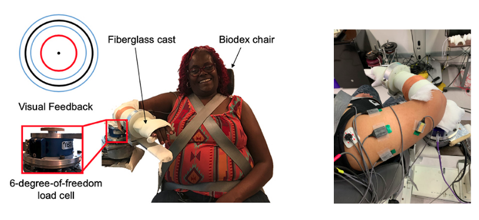
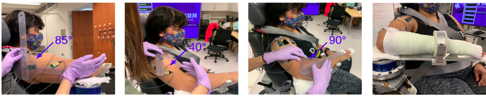

# MUSCLE SYNERGY IDENTIFICATION
This repository provides Python code for extracting and processing the experimental data as well as the code for muscle synergy identification and result plotting. 

For details in experimental procedures, muscle synergy hypothesis as well as result analysis, please refer to my [portfolio post](https://mushenghe.github.io/)

#### _Musheng He_
**March ~ June; Oct ~ Dec 2020**

- [Method](#method)
  - [Hardware Setup](#hardware-setup)
  - [Experimental Procedures](#experimental-procedures)

- [Demo and Result](#demo-and-result)

- [Software Structure & Included packages](#packages-breakdown)

#### Description

This project aims to identify how muscles are synergistically activated at the arm during a multi-joint task.

#### Motivation

While seemingly simple, a motor task, such as retrieving an object from a high shelf, is very complicated. To achieve this task, movement-related signals are generated from the motor cortex of our brain and relayed to muscle fibers via motor neurons. In turn, muscles contract and the arm is raised and extended. There are more than 600 muscles in our body. Instead of controlling each muscle individually, our brain is thought to recruit these muscles in set groups. The activation of muscles in this grouped manner is termed muscle synergies and is part of a hierarchical control strategy. Activation of muscle synergies, rather than individual muscles, allows for a simplified control of one’s limb. In this work, the focus is on muscle activation at the arm. Specifically, the goal is to determine how muscles concurrently activate when an individual abducts at the shoulder and flexes at the elbow. As such, we can determine normal muscle activation patterns in a population that is neurologically and orthopaedically intact.

## Method

#### Hardware Setup

The experimental setup, as shown in Figure 3, was comprised of a custom mechatronic system, a monitor, speakers, and Biodex chair. The system acquires torque data from a six-degree-of-freedom load cell. The acquired data, in conjunction with a biomechanical model, indicate the extent to which the participant flexes about the testing elbow and abducts about the shoulder. In addition, the system quantifies muscle activity using eight surface electromyography (sEMG) electrodes (sEMG1: biceps, sEMG2: triceps lateral, sEMG3: anterior deltoid, sEMG4: medial deltoid, sEMG5: posterior deltoid, sEMG6: pectoralis major, sEMG7: lower trapezius, and sEMG8: middle trapezius). The sEMG signals indicate the electrical activity within each of the eight testing muscles. A DAQ card acquires data from these sensors, and a Matlab program streams the data. Data is collected at 1kHz.

#### Experimental Procedures

The participant was requested to not exercise the day before and of testing to avoid muscle fatigue. At the beginning of the testing session, the participant sat with their torso and waist strapped to the Biodex chair. The participant's testing arm was affixed to an isometric measurement device at 85° shoulder abduction, 40° shoulder flexion, and 90° elbow flexion.

## Demo and Result

- One can find a demo video [here](https://youtu.be/x7HlRIp5OJ0)
  
- Four muscle synergies are decomposed when shoulder abduction load is 10 % MVT shoulder abduction, two muscle synergies are decomposed when that is 50% MVT shoulder abduction.

## Packages Breakdown

#### helper

- This folder is a model folder that contains a collection of modules. 
- Each modules contains helper functions that being used in different programs

##### read_data.py

- This script extracts data from baseline task, maximum task as well as isometric torque generation task.
- This script process the data collected and return a csv file that contains 500 data points of sEMG signals for each participant 

##### nmf_crosscal.py
- This script use nonnegative matrix factorization to find synergies that best explains the observed muscle activation patterns.

#### all_subjs.py
- This script reads the extracted data and plot the synergies found through nonnegative matrix factorization.

#### Test environment

Hardware:

- Biodex chair (System 3 ProTM; Shirley, NY, USA)
- Six-degree-of-freedom force/torque sensor (JR3, Model: 45E15A 1000N; Woodland, CA, USA). 
- Monitor
- Speaker

Software:
- Linux Machine
- Python 3.6
- Matlab

Package Requirement:
- numpy
- matplotlib
- pytest
- sklearn
- pandas